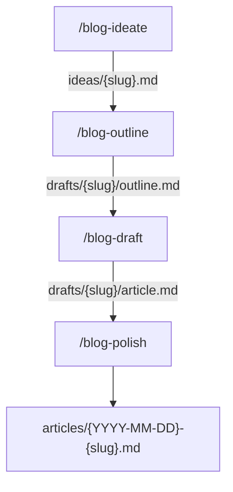

# blogs

AI 時代の開発に関するブログ記事を、AI とブレストしながら書く作業場。
公開先は決め打ちせず、まずは GitHub 上で素の Markdown として記事を蓄積する。
AI（Claude Code）の振る舞いに関する設定は [CLAUDE.md](./CLAUDE.md) を参照。

## ディレクトリ構成

| パス                     | 役割                                                                         |
| ------------------------ | ---------------------------------------------------------------------------- |
| `ideas/`                 | `/blog-ideate` の出力。コンセプトメモ。日付なしファイル名                    |
| `drafts/{slug}/`         | `/blog-outline`〜`/blog-draft` の作業場（outline.md, article.md）。日付なし  |
| `articles/`              | 公開済み記事。ここでだけ `YYYY-MM-DD-{slug}.md` の形式で日付を付ける         |
| `.claude/skills/blog-*/` | ワークフロー用 SKILL とその雛形（`templates/` をスキル配下にコロケーション） |

## ファイル命名規則

- `ideas/{slug}.md`: 日付なし
- `drafts/{slug}/outline.md`, `drafts/{slug}/article.md`: 日付なし
- `articles/{YYYY-MM-DD}-{slug}.md`: `/blog-polish` で公開する瞬間に日付を付与

スラグは `kebab-case-title`。ideate → outline → draft → polish を貫いて同じスラグを使う。

## ワークフロー



各段階の詳細は対応する `.claude/skills/blog-*/SKILL.md` を参照。
段階を飛ばさない。飛ばす場合はその場で確認する。

## 記事 frontmatter スキーマ

```yaml
---
title: # 公開タイトル
slug: # kebab-case-title
status: idea | outline | draft | published
created: YYYY-MM-DD # ideate 時に確定
updated: YYYY-MM-DD # 更新の都度
tags: []
summary: # 1〜2 行の要約
---
```

## コミット規約

- Conventional Commits（`commitlint` で検証）
- 記事追加・更新は `docs:` プレフィックス（例: `docs: add article "..."`）
- pre-commit hook（lefthook）で `oxfmt --check` と `oxlint` が走る
