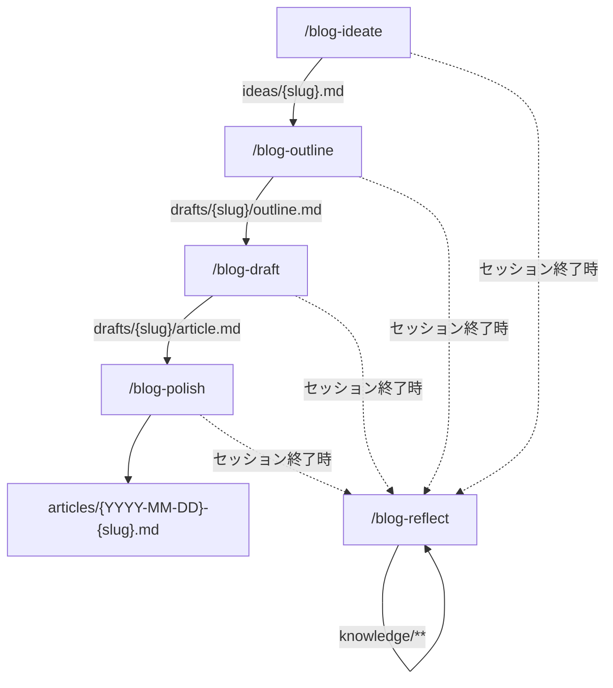

# blogs

AI 時代の開発に関するブログ記事を、AI とブレストしながら書く作業場。
公開先は決め打ちせず、まずは GitHub 上で素の Markdown として記事を蓄積する。
AI（Claude Code）の振る舞いに関する設定は [CLAUDE.md](./CLAUDE.md) を参照。

## ディレクトリ構成

| パス                     | 役割                                                                         |
| ------------------------ | ---------------------------------------------------------------------------- |
| `ideas/`                 | `/blog-ideate` の出力。コンセプトメモ。日付なしファイル名                    |
| `drafts/{slug}/`         | `/blog-outline`〜`/blog-draft` の作業場（outline.md, article.md）。日付なし  |
| `articles/`              | 公開済み記事。ここでだけ `YYYY-MM-DD-{slug}.md` の形式で日付を付ける         |
| `knowledge/`             | `/blog-reflect` の出力。書き手の癖・進め方・スキル改善案の長期メモ           |
| `.claude/skills/blog-*/` | ワークフロー用 SKILL。各記事の雛形は SKILL.md 末尾にコードブロックとして同梱 |

## ファイル命名規則

- `ideas/{slug}.md`: 日付なし
- `drafts/{slug}/outline.md`, `drafts/{slug}/article.md`: 日付なし
- `articles/{YYYY-MM-DD}-{slug}.md`: `/blog-polish` で公開する瞬間に日付を付与

スラグは `kebab-case-title`。ideate → outline → draft → polish を貫いて同じスラグを使う。

## ワークフロー


```mermaid
flowchart TD
    A["/blog-ideate"] -->|"ideas/{slug}.md"| B["/blog-outline"]
    B -->|"drafts/{slug}/outline.md"| C["/blog-draft"]
    C -->|"drafts/{slug}/article.md"| D["/blog-polish"]
    D --> E["articles/{YYYY-MM-DD}-{slug}.md"]
    A & B & C & D -.->|"セッション終了時"| R["/blog-reflect"]
    R -->|"knowledge/**"| R
```

各段階の詳細は対応する `.claude/skills/blog-*/SKILL.md` を参照。
段階を飛ばさない。飛ばす場合はその場で確認する。

`/blog-reflect` はワークフロー外の **第5段階**。セッション内で生まれた言語化の癖・進め方の気づき・既存スキルへの改善提案を `knowledge/` に蓄積する。`ideas/`, `drafts/`, `articles/` が更新されたセッションの終了時、Stop hook が自動で振り返りを促す。

### 補助スキル: humanizer

AI 臭い文章のパターンを検出するスキルとして [`humanizer`](https://github.com/blader/humanizer) を使う。置き場所はユーザー領域の `~/.claude/skills/humanizer/`。検出するのはダッシュの多用・機械的な太字・三点強調・アフォリズム化など（Wikipedia「Signs of AI writing」ベース）。blog-draft（書く時点）と blog-polish（推敲時）から観点を借りて使う。

- **全文リライト型なので丸ごとは当てない**。検出項目を 1 つずつ本人判断で反映する（一次体験・語りを削らないため）
- セットアップ: [blader/humanizer](https://github.com/blader/humanizer) をユーザーの `~/.claude/skills/` に導入しておく（このリポジトリには含まれない）。未導入なら blog-draft / blog-polish の humanizer 参照箇所は手動チェックで代替する

### 補助スキル: book-log

読んだ本を記録するスキル。「本を読んだ」と報告したら発動する。書誌（原題・訳者・出版社・刊行年・ISBN）を一次情報から取得する。概要を下書きし、使いどころは本人にヒアリングする。そのうえで `knowledge/books/{slug}.md` を作り、索引 `knowledge/books.md` に1行追加する。ワークフローの外で、記事の参考文献や根拠を再利用しやすくするのが目的。

- 1冊につき1ファイル。索引は `knowledge/books.md` がリンク一覧と運用ルールを持つ
- 書誌は AI の記憶で埋めず、出版社ページや CiNii など一次情報で裏取りする

### 校正: textlint

文章校正は [textlint][textlint] で機械チェックする。プリセットは 2 つ。AI 臭を検出する [ai-writing プリセット][preset-ai] と、日本語の技術文の作法をみる [ja-technical-writing プリセット][preset-ja] を使う。設定は `.textlintrc.json`。対象は `node_modules/` を除く全 Markdown（除外は `.textlintignore` で管理）。ルールはほぼ厳格運用。カジュアルな文体と両立しない `ja-no-weak-phrase`（「思います」等）だけ off にし、疑問符 `？` は許可している。

次の経路で効く。

- `pnpm textlint` / `pnpm textlint:fix`: 手動実行
- pre-commit hook（lefthook）: ステージした `*.md` を検査
- Claude Code hook（PostToolUse）: Claude が `*.md` を編集すると textlint が走る。指摘は Claude に差し戻す（`.claude/hooks/textlint-on-edit.sh`）
- `/blog-polish`: 推敲の最初に `pnpm textlint` をかけ、観点別チェックの材料にする

[textlint]: https://github.com/textlint/textlint
[preset-ai]: https://github.com/textlint-ja/textlint-rule-preset-ai-writing
[preset-ja]: https://github.com/textlint-ja/textlint-rule-preset-ja-technical-writing

humanizer 同様、**丸ごと `--fix` を当てて書き換えない**。指摘を 1 つずつ本人判断で反映し、文体・語りを守るため当てない指摘も選んでよい。

## 記事 frontmatter スキーマ

```yaml
---
title: # 公開タイトル
slug: # kebab-case-title
status: idea | outline | draft | published
created: YYYY-MM-DD # ideate 時に確定
updated: YYYY-MM-DD # 更新の都度
tags: []
summary: # 1〜2 行の要約
---
```

## コミット規約

- Conventional Commits（`commitlint` で検証）
- 記事追加・更新は `docs:` プレフィックス（例: `docs: add article "..."`）
- pre-commit hook（lefthook）で `oxfmt --check`・`oxlint`・`textlint`（ステージした全 `*.md`）が走る
