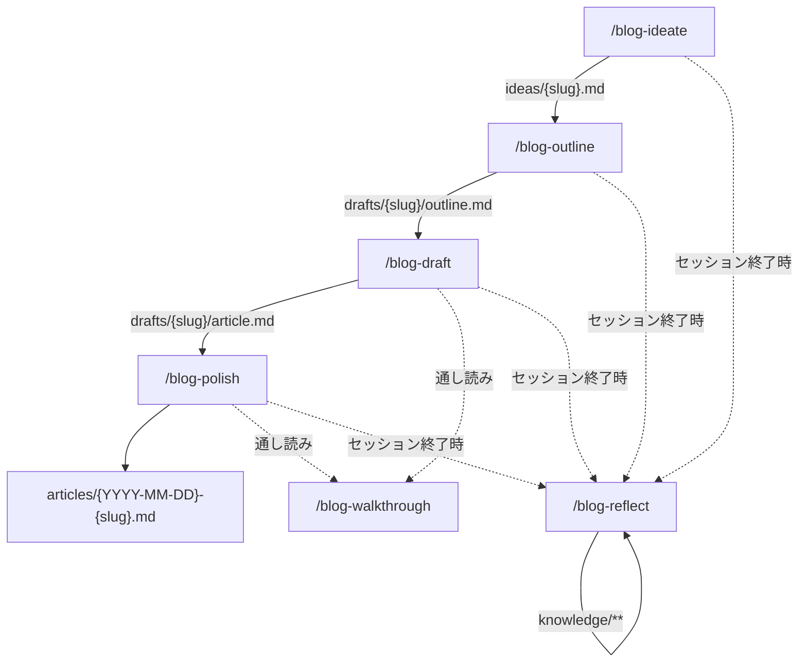

# ワークフロー

記事は 4 つの段階を順に通って公開される。段階を飛ばさない。飛ばす場合はその場で確認する。



各段階の詳細は対応する `.claude/skills/blog-*/SKILL.md` を参照。

`/blog-reflect` はワークフロー外の **第5段階**。セッション内で生まれた言語化の癖・進め方の気づき・既存スキルへの改善提案を `knowledge/` に蓄積する。`ideas/`, `drafts/`, `articles/` が更新されたセッションの終了時、Stop hook が自動で振り返りを促す。

`/blog-walkthrough` は draft 以降のどの段階からでも呼べる通し読み。補助スキルの詳細は [skills.md](./skills.md) を参照。

## 記事 frontmatter スキーマ

```yaml
---
title: # 公開タイトル
slug: # kebab-case-title
status: idea | outline | draft | published
created: YYYY-MM-DD # ideate 時に確定
updated: YYYY-MM-DD # 更新の都度
tags: []
summary: # 1〜2 行の要約
---
```
