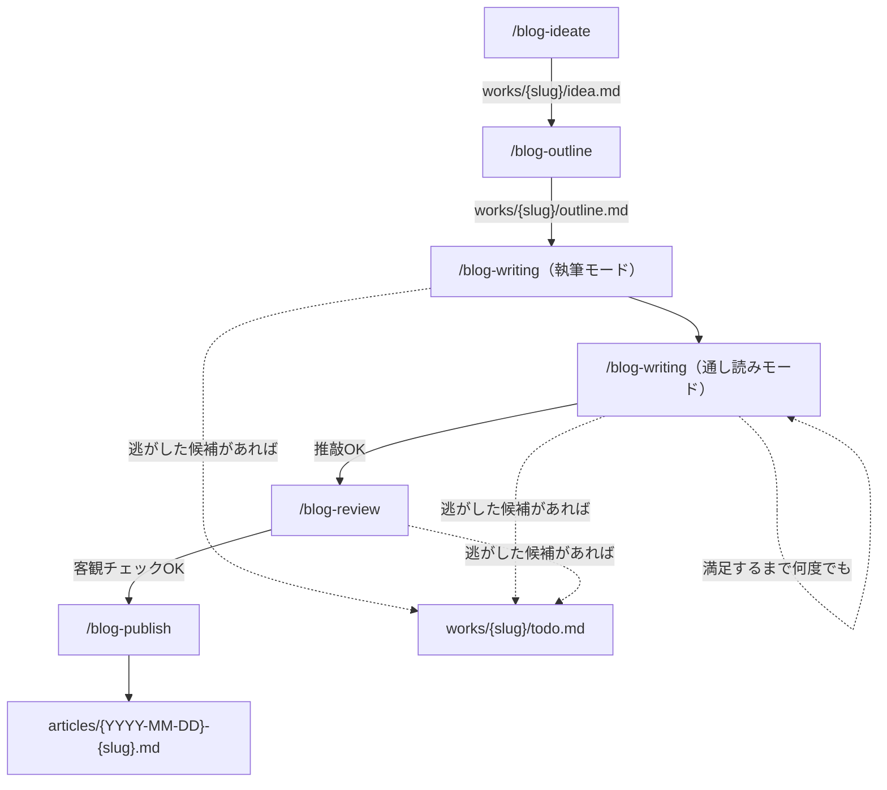
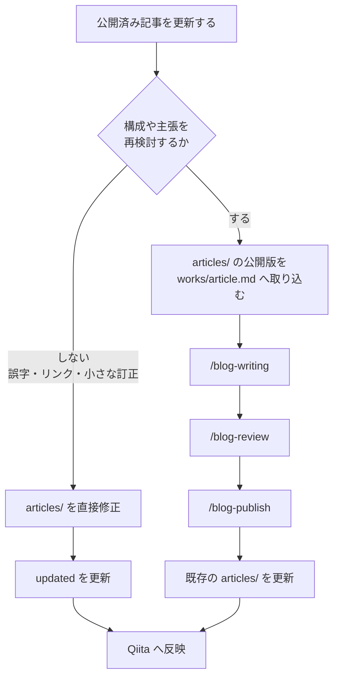
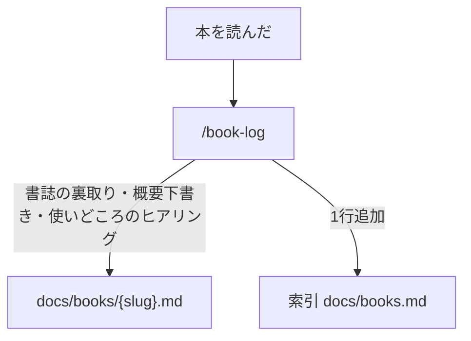
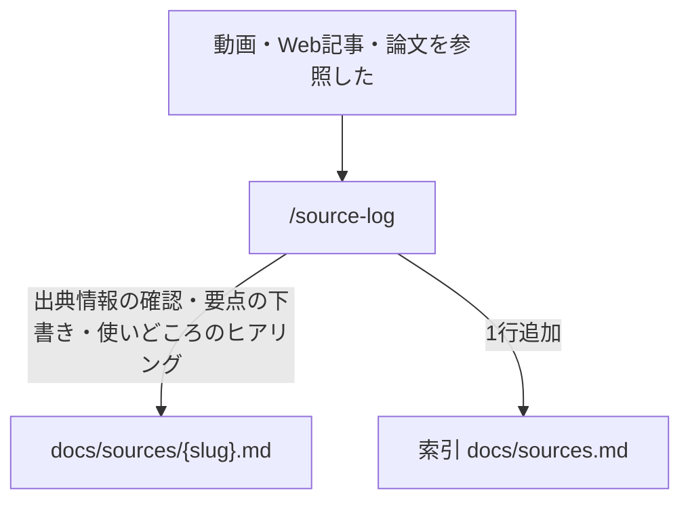

# ワークフロー

このリポジトリのワークフローは「記事の執筆」「参照資料の記録」「振り返り」の 3 系統。各スキルの一覧は [skills.md](./skills.md) を参照。

## 記事の執筆

記事はいくつかの段階を順に通って公開される。段階を飛ばさない。飛ばす場合はその場で確認する。執筆と公開の間には、書き方の推敲（blog-writing の通し読みモード）と内容の客観チェック（blog-review）の 2 段階を挟む。

各段階の出力は同じ `works/{slug}/` ディレクトリに集まる（idea.md, outline.md, article.md, review.md）。1 slug 1 ディレクトリで、公開前まではここが唯一の置き場になる。

各段階の詳細は対応する `.claude/skills/blog-*/SKILL.md` を参照。

`/blog-writing` はセクション単位の執筆モードと、記事全体の通し読みモードの両方を担う 1 つのスキル。通し読みモードは textlint/humanizer の機械チェックと用語ブレなどの人判断チェックを含み、1 回では指摘を出し切らない設計のため、納得いくまで何度でも呼び直す。

`/blog-review` は書き方ではなく内容を対象にした客観チェック。会話履歴を持たない独立したサブエージェントに記事だけを読ませ、内容の漏れ・矛盾・根拠不足・読者理解のギャップを第三者視点で洗い出す。`/blog-publish` は推敲・客観チェックが済んだことを前提に、frontmatter 確定・参考文献の整形・ファイル移動・コミット案内という公開作業だけを行う。

`works/{slug}/todo.md` は最初から存在するファイルではない。`/blog-writing` の執筆中・通し読み中や `/blog-review` で見つかった、本文に即書かず逃がしたい課題を書く先として初めて作られる。生まれる条件は [structure.md](./structure.md)「works/{slug}/todo.md が生まれるケース」を参照。

各段階が出力する記事ファイルの frontmatter スキーマは [templates.md](./templates.md) を参照。

## 公開後の更新

`articles/` は現在公開している内容の正本、`works/` は次の改稿を進める作業場とする。公開後の更新は、記事の構成や主張を再検討するかどうかで流れを分ける。

どちらの流れでも、`articles/{初回公開日}-{slug}.md` のファイル名は変えない。更新日は frontmatter の `updated` に記録する。内容改稿では `articles/` の公開版から作業を始め、古い `works/{slug}/article.md` をそのまま改稿の起点にしない。

具体的な操作と Qiita への反映手順は [release.md](./release.md) を参照。

## 振り返り

`/retrospective` は記事の執筆・本の記録どちらの段階の出力でもなく、`blog-*` の命名規則にも属さないシステム側のスキル。特定の段階に紐づく図では表しにくい。`works/`, `articles/` のどちらかが更新されたセッションの終了時、Stop hook が横断的に発火する仕組みだからだ。

セッション内で生まれた言語化の癖・進め方の気づき・blog システムへの改善提案を `docs/` の振り返りメモに蓄積する。詳細は `.claude/skills/retrospective/SKILL.md` を参照。

## 本の記録

読んだ本を `docs/books/` に蓄積し、記事の参考文献や根拠として再利用しやすくする。記事の執筆フローとは独立して、本を読んだタイミングで回す。

`/book-log` は「本を読んだ」と報告したら発動する。書誌（原題・訳者・出版社・刊行年・ISBN）は AI の記憶で埋めず、出版社ページや CiNii など一次情報で裏取りする。1 冊 1 ファイルで、索引 [books.md](./books.md) がリンク一覧と運用ルールを持つ。詳細は `.claude/skills/book-log/SKILL.md` を参照。

## オンライン資料の記録

動画・Web記事・論文を `docs/sources/` に蓄積し、記事の出典や補足として再利用しやすくする。

`/source-log` は公式の掲載元で出典情報を確認し、資料の要点と記事での使いどころを分けて記録する。書籍は固有の書誌項目があるため `/book-log` で扱う。詳細は `.claude/skills/source-log/SKILL.md` を参照。
