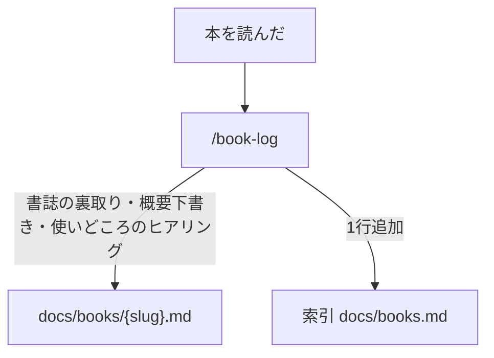

# ワークフロー

このリポジトリのワークフローは「記事の執筆」と「本の記録」の 2 系統。各スキルの一覧は [skills.md](./skills.md) を参照。

## 記事の執筆

記事は 4 つの段階を順に通って公開される。段階を飛ばさない。飛ばす場合はその場で確認する。

各段階の詳細は対応する `.claude/skills/blog-*/SKILL.md` を参照。

`/blog-reflect` はワークフロー外の **第5段階**。セッション内で生まれた言語化の癖・進め方の気づき・blog システムへの改善提案を `docs/` の振り返りメモに蓄積する。`ideas/`, `drafts/`, `articles/` が更新されたセッションの終了時、Stop hook が自動で振り返りを促す。

`/blog-walkthrough` は draft 以降のどの段階からでも呼べる通し読み。

各段階が出力する記事ファイルの frontmatter スキーマは [templates.md](./templates.md) を参照。

## 本の記録

読んだ本を `docs/books/` に蓄積し、記事の参考文献や根拠として再利用しやすくする。記事の執筆フローとは独立して、本を読んだタイミングで回す。

`/book-log` は「本を読んだ」と報告したら発動する。書誌（原題・訳者・出版社・刊行年・ISBN）は AI の記憶で埋めず、出版社ページや CiNii など一次情報で裏取りする。1 冊 1 ファイルで、索引 [books.md](./books.md) がリンク一覧と運用ルールを持つ。詳細は `.claude/skills/book-log/SKILL.md` を参照。
