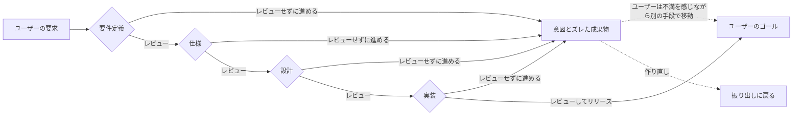

# 批判的思考でエージェントの成果物に向き合う

コーディングエージェントのおかげで、開発の速度は明らかに上がりました。指示すれば、正しく動くコードが短時間で返ってきます。一方で、意図していないものが出来上がって、大幅なやり直しになる場面も増えました。

意図しないものを作ってしまうこと自体は、開発速度が遅かった AI 以前からあった問題です。それが、エージェントの浸透で一度に作れる物量が増えた結果、認識ズレの指摘回数も増えるようになりました。昔からあった問題が成果物の増幅によって無視できないレベルに表面化してきたわけです。もちろん作り直すコストも減りましたが、この線路の引き直しは、本来はコストの無駄遣いです。線路の分岐のように、早い段階で正しい道へ移動しているほうが無駄にならないのは、人間も、エージェントも一緒です。

エンジニアはこれまで、論理的思考で情報を整理し、現在のコードから整合性を見つけて、反映する術を磨いてきました。エージェントが論理の部分を担当するようになると、自分では説明できないコードをそのまま成果物として提出できてしまいます。なぜこれで良いのかを自分で説明できないと、意図や設計を確かめる仕事はレビューする側へ回り、PdM やテックリードほど負荷が集まります。自分の成果物を自分でディレクションして説明できれば、その分だけ全体が軽くなります。そこで必要になるのが、成果物を説明・説得できる理解力です。

この理解を深めるのに欠かせないのが「問い直す力」、つまり批判的思考です。これまでPdMやデザイナー、あるいはテックリードのような一部のエンジニアが担ってきた領域でしたが、今は誰にでも求められるようになってきています。この記事では、私がエージェントに対して実際にやっている問い直しと、その土台になっているセルフレビューの習慣を紹介します。なお、前提にしているのはチームで顧客向けのプロダクトを作る場面です。ターゲットが自分だけの個人開発なら、ここまで問い直さなくても困りません。

## 線路を敷く論理と分岐を切り替える批判

論理的思考は、目的地まで線路を敷く力だと思っています。要件を満たし、矛盾なく、バグなく動くところまで連れていってくれる。エージェントが得意になったのは、まさにこの部分です。指示すれば、現実的に成立する線路をすぐ敷いてくれます。

ただ、論理だけで敷いた線路の終点が、乗っている人が本当にたどり着きたかった目的地とは限りません。惜しいところで終点になれば、乗っていた人はそこから徒歩で移動するしかありません。その線路でいいのかを問い直して、進む先を選び直すのが批判的思考です。今ある前提を疑い、別のルートと比べて、価値の高いほうへ分岐を切り替えていく。

要件定義から実装まで、どの段階にも分岐があります。この図のレビューには、2つの層があります。要件を満たしているか、矛盾やバグがないかを確かめるのが論理的思考のレビュー。その線路でいいのか、進む先そのものを問い直すのが批判的思考のレビューです。前者だけでは、正しく動くのに意図とズレた成果物へまっすぐ進んでしまいます。

この切り替えには2種類あります。線路を活かしたまま、分岐で別のルートを選び直す切り替え。そして、線路そのものが誤っていて、敷き直しが必要になるケースです。気づくのが遅れるほど後者に近づき、敷いた線路ごと引き直すことになります。

大事なのは、論理と批判はどちらかを選ぶものではなく、何度も繰り返すものだという点です。論理で一本敷いて、批判で分岐を選び直して、また論理で詰める。これは、小さく作って検証を繰り返すリーン開発やスクラムのような、アジャイルの進め方にも通じます。ループを速く回せるほど、引き直す線路は短くて済みます。

## エージェントに返す3つの問い直し

エージェントに対して、私が実際によく返している問い直しがあります。

### 前提を疑う

エージェントは与えられた前提の上で最短のルートを引きます。でもその前提自体がずれていることがあります。たとえば、ユーザーが入力できる設定テーブルを作ってもらったときのことです。最初のタスクがローディングの設定の追加だったので、テーブル名もそのままローディングになりました。設定が複数に分かれていることや、将来拡張していく予定は、エージェントにコンテキストとして渡っていませんでした。実際はページ全体の設定を持つテーブルなのに、名前だけ見るとローディング専用に見えてしまう状態でした。そこで、機能全体の本質をもとに定義し直してもらいました。エージェントとのセッションはタスクごとに分かれることが多く、そうなると一機能に対する視野はどうしても狭くなります。セッションの外にある文脈を持ち込んで前提を点検するのは、こちらの役目です。

### 手段を疑う

指示した解決手段が、本当にその課題に対する最善なのかを問い直します。エージェントは「どう実現するか」には強いのですが、与えたプロンプトの時点で進む方向性が決まってしまいます。だからこそ、手段そのものを問い直すのはこちら側の仕事になります。

たとえば、新機能の開発で、事前のリサーチにあったユースケースをもとに実装を進めてもらったところ、それが実現不可能だと後から判明したことがあります。外部トラフィックが必要な機能で、サーバーを立てて人間がテストしないと確認できない項目だったからです。エージェントはそこまで検証できないまま、とりあえず作ってしまう。指示した手段そのものが成立しないと気づいて、別のルートをその場で考案するのはこちらの仕事でした。結果、実装の中身だけでなく、ユーザーの行動フローまで見直すことになりました。外部サービス側のアプリ制約が判明して、アカウント登録の手順そのものが増えたからです。フローが複雑になった分、その導線を説明する機能まで必要になりました。

### 暗黙の要求の抜け落ちを疑う

プロンプトに書かれていない要件は、エージェントにとっては存在しないのと同じです。たとえば性能やセキュリティといった非機能要件や、「ここはやらない」というスコープの線引きは、明示しなければ素通りされます。プランモード（実装の前に計画を立てて確認させる動作）なら踏み込んで確認してくれることもありますが、普通のやりとりだと抜け落ちて、指示を字面どおりになぞっただけのアウトプットになりやすいです。

たとえば、あるデータの管理機能で、項目ごとの画像設定が最初から作られていたことがあります。頼んでいない機能でしたが、別の機能で似た画像設定を作る予定があったので、実装中はそちらのことだと勘違いして通してしまいました。結局、人間のレビューで過剰な実装だと指摘され、取り除く羽目になりました。「ここはやらない」と最初に線を引いていれば作られなかったし、線を引いていれば自分の勘違いにも気づけたはずです。

## 問い直しが言語化を加速させる

この3つの問い直しには、副産物があります。問い直すたびに、言語化が鍛えられていくことです。「こっちのほうが良いのではないか」と感じるとき、そこにはたいてい何かしらの理由があります。その理由を言葉に落とし込まないと、エージェントには何も伝わりません。私の場合、感覚を理由に開くときは「この命名だと限定的な機能に見えるが、実際はもっと広い範囲を持っているのではないか」という形にすることが多いです。さきほどのローディング設定テーブルも、この形で返しました。見えているものと実態のズレを言うだけで、相手には十分伝わります。名前で意図を伝えるという発想は、『リーダブルコード』が一貫して説いてきたことでもあります。

人間どうしなら、五感を使ったコミュニケーションが取れます。表情や口調、その場の空気で「なんとなく気になる」が伝わることもあります。でも LLM（大規模言語モデル）に渡せるのは、テキストか画像です。表情や口調、その場の空気に相当する入力はありません。将来そこが埋まれば話は変わりますが、今のところ意図を伝える手段はほぼ言葉に限られます。だからこそ、こちら側が言語化を強化するしかありません。考えてみれば、言語そのものが、人間どうしをつなぐ最古のインターフェースのようなものです。知性とは情報の圧縮だという見方があります。経験を、短い言葉で取り出せる形にまとめておくことだと思ってください。圧縮された情報を表現するのが言語だとすれば、エージェントとの対話は言語化の訓練そのものと言えます。

[エントロピーの再発明 | 圧縮と知能 Part 1 - 3Blue1BrownJapan](https://www.youtube.com/watch?v=mJiu5tWs3zo)

テックリードのような上位のエンジニアほど、相手に伝えるための言語化能力が高いと感じます。頭の中にある圧縮された情報を、自分で展開して言葉にできる。ジュニアが同じ場所にたどり着くには、経験を重ねて脳に圧縮させる道があります。ただ、道はそれだけではありません。言語化によるショートカットが使えます。たとえば UI の改修を伝えるときです。スクリーンショットを撮って「ここ」と指すより、パンくず、見出し、ダイアログ、一覧画面と詳細画面の区別といった UI デザインの言葉で指定するほうが、修正指示の速度は上がります。その領域で通じる言葉は、説明の手間ごと圧縮してくれます。言語化のショートカットは、才能ではなく語彙の問題です。

たとえば料理です。レシピという言語化があることで、初心者でも失敗しにくくなりました。そして、レシピが無くても作れる（復元してアウトプットできる）ようになった状態が、情報の圧縮が済んだ状態です。エージェントへの問い直しは、この言語化を日常の中で何度も引き出してくれます。

## 「良いもの」は少ない手数で多くを解く

では、問い直しの先にある「良いもの」とはなんでしょうか。私は、批判的思考を働かせることはデザインやドメインモデルを考えることと似ていると感じています。UI/UX のデザインもドメインモデリング（業務の概念をモデルとして設計すること）も、動くものを前にして「これで本当に良いのか」を問い直す営みだからです。ドメインモデリングの原典『エリック・エヴァンスのドメイン駆動設計』も、モデルを作って終わりではなく、問い直しながらモデルとコードを深めていく本でした。

長年プログラミングをしてきた経験則として、良いデザインは1つの判断で複数の問題を解きます。重要なロジックを1つのクラスにまとめて、そのクラス経由でしか呼べないようにしたことがあります。それまでは同じ処理があちこちに散らばっていました。まとめただけで重複が消えて、後続の実装も迷わなくなりました。少ない手数で多くを解けるものは、たいていシンプルです。分離が効く場面なら、良い実装は捨てやすく、独立していて、他と干渉しません。たとえるなら乾電池です。規格が決まっているから単体で交換できて、切れたら捨てて入れ替えるだけで、機器の側には手を入れずに済みます。ただし、ドメインそのものが複雑な場合もあります。そこで無理に単純化すると、シンプルになったのではなく要件を削っただけ、ということが起こります。

一方でエージェントの生成物は、ボリュームが多くなりがちです。放っておくと、シンプルな実装から遠のいていきます。過剰に作ってしまうこと自体は、オーバーエンジニアリング（必要以上に作り込んでしまうこと）として昔から知られてきた問題です。エージェントはそれを短時間で量産できてしまいます。エラーハンドリングのような重要な処理はもちろん要りますが、それも再利用できる形に寄せたい。目指すのは、『プリンシプル オブ プログラミング』でも紹介されている KISS の原則（Keep It Simple, Stupid。シンプルに保て）です。

さらに言えば、実装はしなければしないほど良い、とも思っています。顧客に提供するプロダクトでは、書いたコードの分だけ運用コストが増えます。しかもその負担は、書いた本人だけでなくチーム全体に及びます。エージェントは頼めばいくらでも書いてくれますが、「そもそも書かない」という選択肢は、こちらが問い直さないと出てきません。

ただし、シンプルには2種類あります。Mac のユニファイドメモリのように、分かれていたものを統合して構造ごと消すシンプルさ。そしてグラボ・メモリ・CPU が分離された一般的なパーツ構成のように、ミクロで見れば各部品が単純という、分離のシンプルさです。乾電池は後者ですね。『UNIXという考え方』で説かれる「1つのプログラムには1つのことをうまくやらせる」という定理も、この分離のシンプルさです。『モノリスからマイクロサービスへ』が扱う分割の判断も、この線上にあります。どちらを選ぶべきかは文脈で変わります。私の目安は、変更の理由が同じものは統合、別々に差し替わるものは分離です。ただ、目の前のものがどちらなのかを見抜く判断は、ジュニアには難しいものです。

## 増幅されるのは自分が圧縮してきたもの

統合と分離の判断力を鍛えるには、問い直しの積み重ねに加えて、積極的なインプットが要ります。ここで言うインプットは、探究心と言い換えられるかもしれません。なぜそうなっているのか、という why を自ら解消しにいく力です。ただ受け取るだけでは駄目で、自分なりに考えて、似ている構造を見つけにいくこと。実際、この統合と分離の対比も、ハードウェアの構成という別分野から見つけた相似です。分野の違うものの中に同じ構造を見つけたとき、その構造は自分のものになります。

そして、この探究心による情報の圧縮を事前に終えた人ほど、LLM との対話力が上がります。LLM は増幅器だとよく言われますが、その理由はここにあります。増幅されるのは、自分の中に圧縮して蓄えてきたものだからです。

たとえば、プロダクトのドメインとユビキタス言語（チームで意味を統一して使う言葉）を整理して、エージェントの設定ファイルから参照できるようにしておいたことがあります。それだけで、修正を指示するときに、こちらとエージェントが同じ用語で話せるようになりました。用語をこちらの言葉に翻訳し直す往復が減りました。渡したのは新しい情報ではなく、すでにプロダクトについて圧縮してあった情報です。前の章で挙げた UI デザインの語彙も同じでした。圧縮を済ませた領域ほど、短い言葉が長い説明の代わりになります。

逆も起こります。知らない言葉や概念が出てきたときは、作業を止めて意味を尋ねる工程が挟まります。その分だけ進みは遅くなります。かといって、その工程を省けば、分からないまま先へ進むことになります。ここで削った時間は、あとで自分に返ってきます。

DORA の 2025 年のレポートも、AI の主な役割は増幅器であり、組織がすでに持っている強みと弱みの両方を拡大すると述べています。強いチームはさらに速くなり、弱いチームは既存の問題が深刻化する。組織の話ですが、個人の中でも同じことが起きていると思っています。

[State of AI-assisted Software Development 2025 - DORA](https://dora.dev/research/2025/dora-report/)

## プレイヤーからディレクターへ切り替わる

特別なことをしているつもりはありません。私がまだ自分でコードを書いていた頃からの、セルフレビューの習慣がそのまま続いているだけです。

コードレビューに出す前は、必ず自分の差分を見直していました。エージェントが流行るずっと前から、差分のすべてを批判的思考で問い直して、納得するまでレビュー依頼を出しませんでした。出発点は、自分のアウトプットをまず信用しないことです。そのうえで、仕組みやロジック、言語化で自分自身を納得させていきます。設計も、ひと通り終わってから全体を俯瞰して見直す。これを習慣にしていると、書いているときの視点と、見直すときの視点が分かれてきます。手を動かすプレイヤーの視点から、全体を見るディレクターの視点へ、頭が切り替わる感覚です。ここでのディレクターは、ゲームのディレクターを想像してもらうのが近いです。作るものの方向や良し悪しを決める立場で、Web 開発でいえばマネージャーの役割に重なります。

ディレクター側に立つと、決まって出てくる問いがあります。「そもそも、なんでこれを作ってたんだっけ」。手を動かしているといつのまにか消えてしまうこの問いに、自分で答えられるようになるまでは提出しない。これは自分でコードを書いていた頃も、エージェントに書かせる今も、まったく変わりません。

## 理解負債がレビューを省かせる

### 見る量は自分で決められる

エージェント時代では、人間が書いていた頃とは比べものにならない量のコードが短時間で出てくるので、レビューすべき総量そのものが増えました。

ただ、見る量は自分でコントロールできます。タスクを分割して、スコープを先に定める。差分が大きく出てきたときも、まずは API まわりだけ、次はコンポーネントだけ、というように領域を絞ってコメントを返します。修正のイテレーションを重ねていく形です。そうすれば、一度に向き合うのは「見られる量」におさまります。

### 省略の正体は理解負債

それでもレビューを省略してしまうことがあります。その正体を、私は理解負債だと思っています。リポジトリのことをよく分かっていないから、出てきたコードの良し悪しも判断できず、つい素通りする。レビューを最速にするのは、エージェントの出力よりリポジトリ全体を知っていることです。

この理解負債への手当ては、仕組みの側でも試している最中です。開発フェーズでは、要件定義や設計のドキュメントをエージェントに自動生成させています。これのおかげで、タスクを跨いだ情報にもアクセスできるようになりました。ただ、デメリットもあります。ドキュメントが多すぎて、ジュニアが把握しきれない。書いてあることの理解が追いつかず、指摘までたどり着けない、ということも起きています。いまは文章の可読性を上げる取り組みに加えて、人間の把握そのものをハーネス（エージェントを支える周辺の仕組み一式）に組み込めないか検討しているところです。

ドキュメントを読んで詰まったときの逃げ道も要ります。作業の本筋を止めずに脇で質問できる手段を持っておくのがおすすめです。Claude Code には `/btw` があり、会話に追加しないサイドクエスチョンとして質問できます。追加の設定は要らないので、知らない言葉や概念が出てきたその場で解消できます。学びを始める一歩としてちょうどよい重さです。手が止まる時間を惜しんで素通りするより、分からない領域を減らしていくほうが、結局は速くなります。

同じ問題意識を扱った記事に、Geoffrey Litt の「理解こそが新しいボトルネック」という講演録があります。クイズやゲームのような形で、理解を楽しく進める技法も紹介されていて、一考の価値がありました。

[Understanding is the new bottleneck - Geoffrey Litt](https://www.geoffreylitt.com/2026/07/02/understanding-is-the-new-bottleneck.html)

「エージェントが賢くなれば、こうした取り組みは不要になるのでは」と思う人もいるかもしれません。私はそう考えていません。どれだけ賢い人でも、入社直後は分からないことだらけのはずです。組織やコミュニティに入ったばかりの頃は、誰でもそうです。最初は理解負債から始まる。エージェントも同じで、性能が上がっても取り組み続けるべきものです。むしろ、人間の枠組みや仕組みを取り入れることが、エージェントが低コストで人のアウトプットへ近づけるショートカットになります。新入社員がオンボーディングで立ち上がるのも、ドキュメントや先輩への質問という、人間のために作られた仕組みがあるからです。だから、人間のために作られた仕組みは、LLM にも有効だと考えています。

組織を仕組みとして捉える話は、前回の記事でも書いています。

[組織とマネジメントとソフトウェアアーキテクチャ - Qiita](https://qiita.com/ysrkw/items/8db8a4566f51cfaa693d)

## 悪いコスパの傭兵と良いコスパの開拓者

良いコスパとは、全体のコストが下がる取り組みのことです。ここでの全体には、ステークホルダー、つまり作るものについて連絡や報告をし合う人たち全員が含まれます。悪いコスパとはその逆で、自分だけが早くなればよいというエゴで、他のステークホルダーのコストを増やしてしまう取り組みです。一人だけ使い方ややり方が違う、確認の仕方が普段と違う、連絡が取れない、といった働き方です。たとえるなら、傭兵のような仕事ぶりです。良いコスパはその反対で、開拓者のように道を切り開いて、全員が喜ぶことをします。

開拓者側の動きの代表が、方向性のズレへの即時フィードバックです。ズレたまま作り切ってから直すのは、冒頭で触れたとおりコストの無駄遣いです。早い分岐でレビューを返せば、線路ごと引き直さずに済みます。ステークホルダー全員の作り直しコストが下がります。

そして、さきほどの理解負債を放置させるのが、特にジュニアのうちに感じる「時間が足りない」という焦りです。早く出さなきゃ、コスパよく進めなきゃ、という気持ちが、リポジトリを理解する時間を後回しにさせます。ところが、このコスパ意識がかえって効率を下げます。学習に置き換えると分かりやすいかもしれません。長く記憶に残るのは、一気に詰め込んだときではなく、「学ぶ→休む→復習」のサイクルを回したときです。休んでいる間に、脳が情報を整理してくれる。シナプスの可塑性を扱った研究なので、仕事の進め方にあてはめるのは外挿ですが、詰め込みが定着しないという構造は同じだと思っています。

[The right time to learn: mechanisms and optimization of spaced learning - arXiv](https://arxiv.org/abs/1606.08370)

エージェントもメモリやコンパクト（長くなった文脈の圧縮）を使って文脈を整理しながら進みます。詰め込みっぱなしにせず、整理する仕組みを挟む。人間の側にも同じ仕組みが要ります。

## 批判的思考はエージェントにも組み込める

ここまで人間側の話をしてきましたが、この問い直しの構造は、エージェントの組み立て方そのものにも持ち込めます。やり方はいくつかあります。

1回の出力で終わらせないことです。「いま書いたコードを別の観点から批判してみて」と問い直しを挟み、計画と実行と検証のループを回させます。回数そのものよりも、指摘が出なくなるまで回すことが本質です。私の場合はそれが3回程度で、そこまで繰り返すと、明らかな指摘が出尽くした状態から人間のレビューを始められるようになりました。案をひとつに絞らせないのも有効です。複数の方針を並列で出させて見比べると、論理だけでは見えなかった良し悪しが浮かびます。レビュー役のサブエージェントを別に立てるのも効果があります。

私が実際にやっているのは、スキルや hooks（特定のタイミングで処理を自動実行する仕組み）への組み込みです。Claude Code 寄りの話になりますが、hooks で振り返りを自動化してからは、セッションの終わりにモデルが振り返り（レトロスペクティブ）を行ってくれます。ほかにも、ワークフローの途中に問い直しの段階を組み込んだスキルや、主張には必ず根拠をリサーチさせるスキルで効果が出ています。

こうしたループは、実はエージェント構築の基本要素です。Claude Code のようなコーディングエージェントも、文脈を集めて、動いて確かめる繰り返しで成り立っています。人間が頭の中でやっていた試行錯誤を、そのままプログラミングできるようになった。

## まとめ

最後に整理します。論理的思考と批判的思考は、どちらかを選ぶものではなく、ループさせるものです。論理で線路を敷き、批判で分岐を切り替える。エージェントが論理側を引き受けてくれる今、切り替える側に回るのはエンジニア自身です。これは新しいスキルというより、セルフレビューという昔ながらの習慣で鍛えられる、拡張された役割だと思っています。

明日から何か1つだけ試すとしたら、差分を出す前に「そもそも、なんでこれを作ってたんだっけ」と自分に問うことをすすめます。答えられなければ、まだ出すときではありません。ここから、3つの問い直しも、領域を絞ったレビューも、エージェントへの組み込みも伸びていきます。問い直すたびに言葉が増えて、増えた言葉がまた次の問い直しを速くします。

批判的に問い直す力と、文脈を整理しながら探索する構造。この2つにおいて、人間とエージェントは思っているより似ています。だとすれば、エージェントとうまく付き合うことは、自分自身の考え方を見つめ直すことでもあるのかもしれません。

## 参考文献

- エヴァンス, エリック. エリック・エヴァンスのドメイン駆動設計. 今関剛 監訳, 和智右桂, 牧野祐子 訳. 翔泳社, 2011.
- ガンカーズ, マイク. UNIXという考え方: その設計思想と哲学. 芳尾桂 訳. オーム社, 2001.
- ボズウェル, ダスティン; フォシェ, トレバー. リーダブルコード: より良いコードを書くためのシンプルで実践的なテクニック. 角征典 訳. オライリー・ジャパン, 2012.
- ニューマン, サム. モノリスからマイクロサービスへ: モノリスを進化させる実践移行ガイド. 島田浩二 訳. オライリー・ジャパン, 2020.
- 上田勲. プリンシプル オブ プログラミング: 3年目までに身につけたい一生役立つ101の原理原則. 秀和システム, 2016.
